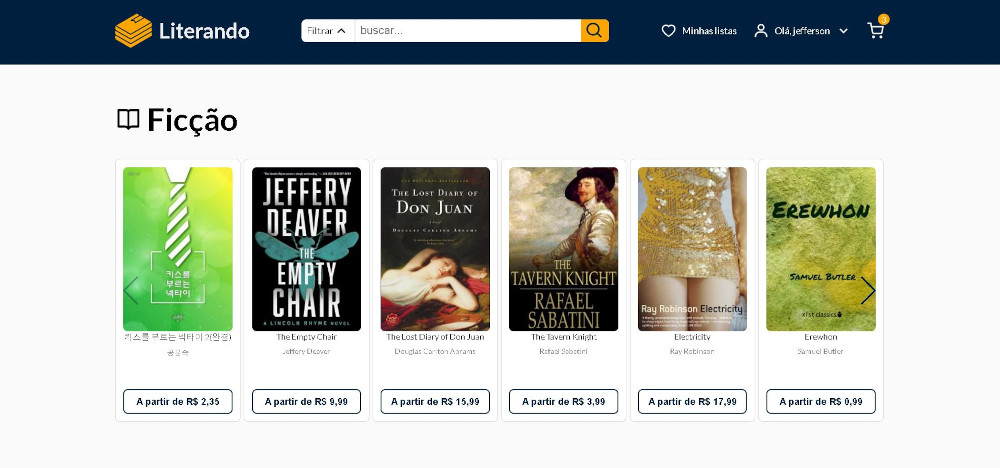

# Literando

<!---Esses são exemplos. Veja https://shields.io para outras pessoas ou para personalizar este conjunto de escudos. Você pode querer incluir dependências, status do projeto e informações de licença aqui--->

> E-commerce de livros.
 
Todas as informações contidas foram retiradas da <a href="https://developers.google.com/books"> Google Books Api´s.</a>
 

 

<h4 align="center"><a href="https://literando.vercel.app/" target="_blank">Clique para visitar o projeto</a></h4>

## 📚 Seções

O site é composto por quatro seções:

- **Home:** Apresenta livros separados por gêneros;
- **Livro:** Página dinâmica que exibe o livro escolhido e títulos similares;
- **Pesquisa:** Rota dinâmica que exibe os resultados de pesquisa;
- **Minha Lista:** nesta seção temos a lista de livros favoritos do usuário;
- **Meu Carrrinho:** Exibe os produtos adicionados ao carrinho pelo cliente;
- **Login - Cadastrar:** Seção de login do usuario;
- **Cadastro - Cadastrar:** Página de criação do usuário;
- **Alterar senha - Cadastrar:** Rota usada para redefinição de senha do usuário

---
 

## 🚀  Funcionalidades

O projeto visou a criação de um E-commerce a partir de tais tecnologias:

- Nextjs;
- Context-React;
- TypeScript;
- Html;
- Styled-components;
- Firebase ( Banco de dados )
- Api Externa ( Google Books );
- NextAuth ( Biblioteca )
- React-icons ( Biblioteca )
- Swiper ( Biblioteca )

---

### Ajustes e melhorias

O projeto não foi concluído tarefas de 1 a 3 finalizadas:

- [x] Refatorar todo o codigo antigo.
- [x] Integrar com literando-api.
- [x] Adicionar funcionalidade de alteraração de senha.
- [] Adicionar funcionalidade de verificação de email.

* Compatível `<Windows / Linux / Mac>`."

 

